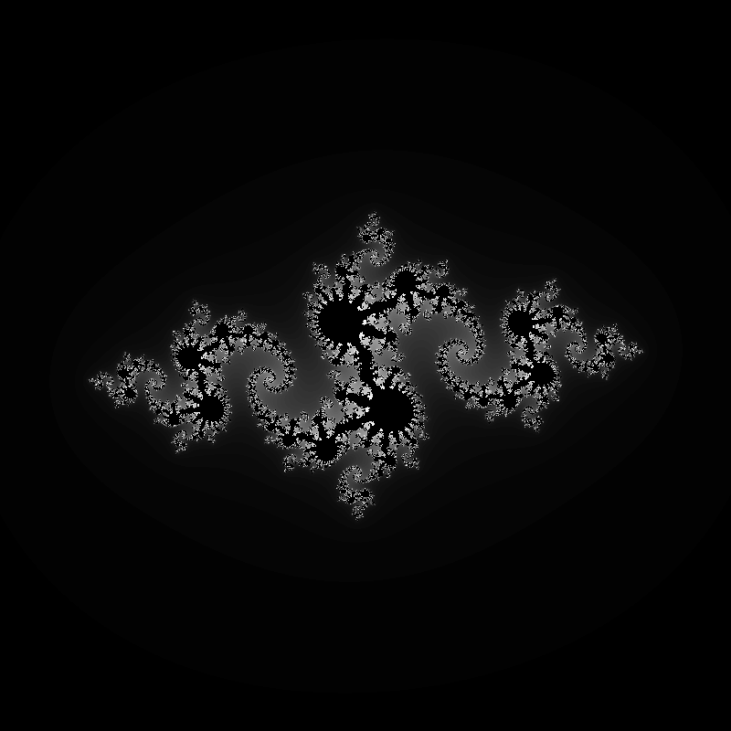

# icylib 🧊
`icylib` is a simple CPU-based image processing and manipulation library built on top of [stb](https://github.com/nothings/stb).

It abstracts away the complexity of working with images by providing a simple interface for drawing shapes, rendering text, chunking images, and much more.

Please note that `icylib` does **not** utilize any hardware acceleration (except SIMD instructions) and is thus not really suitable for real-time rendering. Nonetheless, it does use some fairly optimized algorithms and is still quite fast for a lot of use cases.

## How to use?
icylib is **not** a single-header library for the sake of readability and because of its dependencies. Yet, it is still very easy to use, as it only uses header files for both its interface and its implementation.

If you want to use icylib in your project, you can simply include the header files you need in your source files, and some fancy include guards will take care of the rest.

### Example: [Julia Set](examples/julia)
```c
#define ICYLIB_IMPLEMENTATION

#include "regular_image.h"
#include "color.h"

void main() {
    icylib_RegularImage* image = icylib_regular_create_from_size(800, 800, 3);

    for (int y = 0; y < image->height; y++) {
        for (int x = 0; x < image->width; x++) {
            double a = (double)x / image->width * 4 - 2;
            double b = (double)y / image->height * 4 - 2;
            double ca = -0.8;
            double cb = 0.156;
            int n = 0;
            while (n < 100) {
                double aa = a * a - b * b;
                double bb = 2 * a * b;
                a = aa + ca;
                b = bb + cb;
                if (a * a + b * b > 16) {
                    break;
                }
                n++;
            }
            icylib_Color color = icylib_color_from_rgb(0, 0, 0);
            if (n < 100) {
                color = icylib_color_from_rgb(255 * n / 100, 255 * n / 100, 255 * n / 100);
            }
            icylib_regular_set_pixel(image, x, y, color);
        }
    }

    icylib_regular_save_to_file(image, "julia_set.png");
}
```
```console
$ gcc julia.c -o julia -I path/to/icylib
$ ./julia
```
[](examples/julia/julia_set.png)